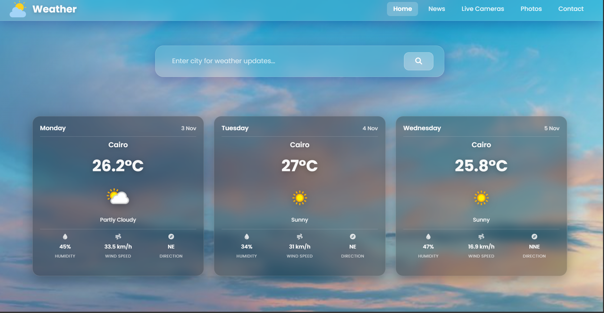

# 🌤️ Weather Forecast Website

A modern and responsive weather forecast website built using **HTML, CSS, JavaScript**, Bootstrap, and WeatherAPI 🌍

The app auto-detects your current location using **Geolocation API** and displays a **3-day weather forecast**, including:
✅ Temperature  
✅ Weather condition  
✅ Humidity  
✅ Wind speed  
✅ Wind direction  

Users can also **search any city** in the world and instantly get updated weather data.

---

## 🚀 Features
- Auto-fetch user location on page load
- 3-day forecast with clean UI weather cards
- City search with live updates while typing
- Glassmorphism modern UI style
- Error handling with SweetAlert2
- Fully responsive using Bootstrap
- Footer with email subscription field

---

## 🛠️ Technologies Used
| Technology | Purpose |
|----------|---------|
| HTML5 | Page structure |
| CSS3 + Custom Design | Styling & glassmorphism effects |
| Bootstrap | Responsive layout |
| JavaScript | App logic & API handling |
| WeatherAPI | Live weather data |
| Geolocation API | Detect user current location |
| Font Awesome | Icons |
| SweetAlert2 | Pop-up alerts |

---

## 📸 Preview Screenshots

